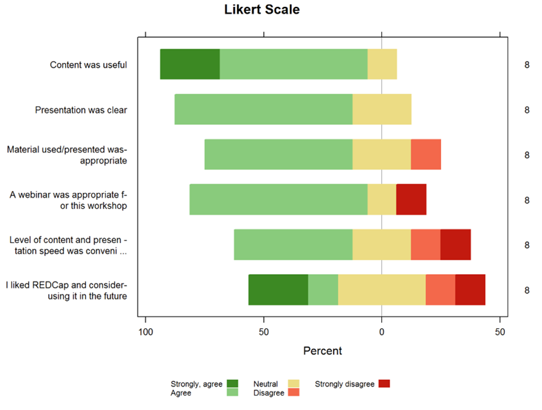
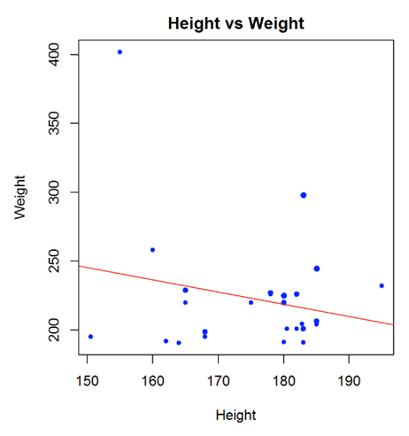
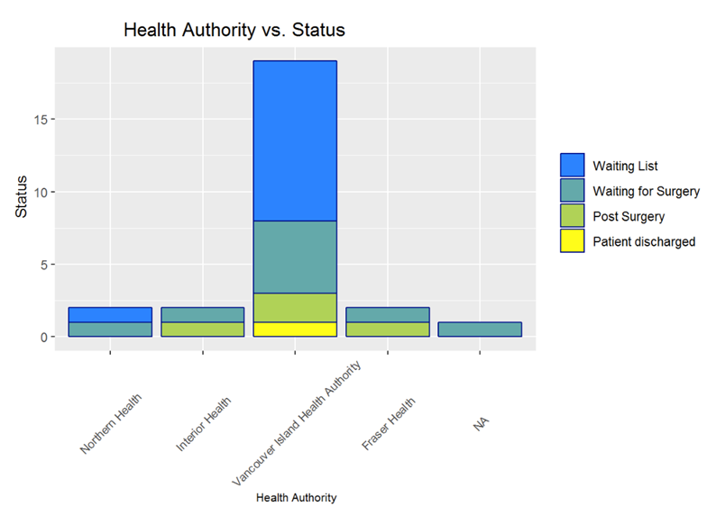
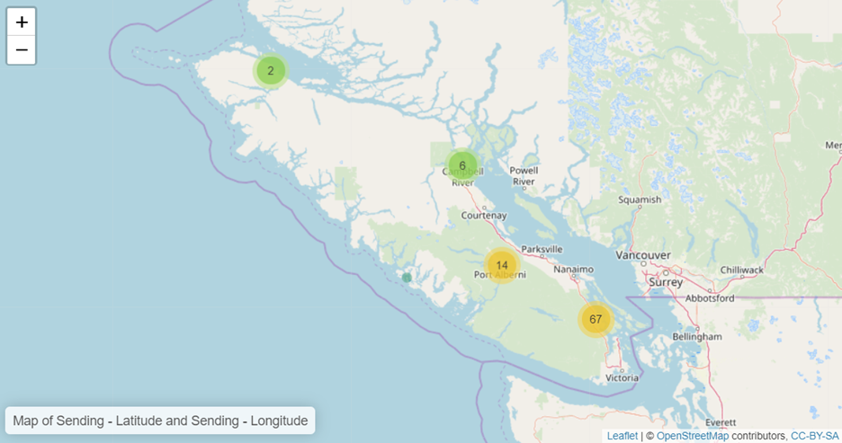

# REDCap module: Advanced Graphs
This REDCap module displays additional advanced graphs from a report in an easy and secure way for REDCap projects, much in the same way as the existing Graphs and Charts tool. 

 The type of graphs generated include Likert scale, scatter plots, stacked bars, cross tabulations and geographical maps. Graphs and tables use labels from the data dictionary for field names and options/categories.

## Prerequisites
- REDCap >= 8.10.12 (It hasn't been tested for previous versions but it may still work for some recent ones).
- R Software for stats >= v 3.5.3 and libraries expss, formattable, ggplot2, htmltools, htmlwidgets, leaflet, likert, plyr, psych, RCurl, HH, stringr and tidyr 
- Export API for each project to use the module

## Easy Installation
- Obtain this module from the Consortium [REDCap Repo](https://redcap.vanderbilt.edu/consortium/modules/index.php) from the control center.

## Manual Installation
- Clone this repo into `<redcap-root>/modules/advanced_graphs_v1.0.0`.
- Go to **Control Center > External Modules** and enable Advanced Graphs.
- To activate this module for a particular project, go to the project home page, click on the **External Modules** link, and then enable Advanced Graphs for that project.

## Features included
This module creates new types of graphs and tables. The possible types are:

**LIKERT SCALE**

Histograms specifically designed for preference (ordinal with positive/negative) options.  

**SCATTER PLOT**

Representation of bi-dimensional graph relating two fields.  

**STACKED BARS**

Bars relating two fields.  

**TABULATIONS**

Cross tabulations showing number of occurrences for any combination of two fields.  

**GEOGRAPHIC MAPS**

Mapping coordinates reported from REDCap in dots showing the number of occurrences for each site.  

## Configuration
Once you enable the Advanced Graphs module, you need to complete a simple configuration process in the Control Center. The elements you need to define are:
 
 - Enable how projects will use Advanced Graphs
 - Include **paths** for RScript, Pandoc and R libraries
 - Include **tokens** created for projects to use Advanced Graphs (to have control on who is using it)

## Usage
To display any of the graphs and tables you need to have a regular REDCap report **open** and click the bookmark **Advanced Graphs** in the External Modules list.

The graphs displayed are selected automatically from the **type of fields** included in the report. 

Fields considered are **categorical** (radio buttons or dropdown lists) or **numeric**; the External Module also considers **key words** in the field name or existing options (for Likert scale graphs or geographic maps, for example).

In several cases a **couple of graphs** are displayed showing each field involved in a bi-dimensional graph in each of the **horizontal/vertical axes**.

Text fields, checkboxes and others are not considered for graphing (some additional types like dates and checkboxes will be added in future versions).

**Events and Repeated events/instruments** are not considered in this version.

Default reports **A** and **B** from "Data Exports, Reports, and Stats" are not considered in Advanced Graphs.

It is recommended to use all features in reports to get adequate graphs. In particular, **filters** are useful to eliminate undesired cases (when appropriate).

Since graphs are generated automatically, their number depends on the number of fields considered in the report. it is recommended to **limit the number of fields** in a report in order to prevent an overflow of graphs. 

In certain particular situations when a graph cannot be displayed or not properly, appropriate messages are shown (when a graph is not displayed, when there are too many categories to display the graph properly, for example).

## Live filters

Advanced Graphs takes into consideration live filters selected within the report, with the exception when the record id field is not included in the report and a filter is selected.

## Testing instrument

This project includes an [Example Instrument](../../modules/advanced_graphs_v1.0.0/docs/AdvancedGraphsDemoProject_2020-01-15.zip) that includes fields, data and reports that can be used to produce each of the type of graphs included in Advanced Graphs. 
It has to be added in the configuration. This is suitable for testing or demonstration purposes.

## Acknowledgements
 * The original R script to deploy graphs was devised by Victor Espinosa at Vancouver Island Health Authority.  
 * The plugin to trigger the graphs was written by Alvaro Ciganda and converted to an external module.
 * Alvaro Ciganda greatly contributed to improve efficiency in the R code.
 * Victor Espinosa collaborated in documenting the external module.
